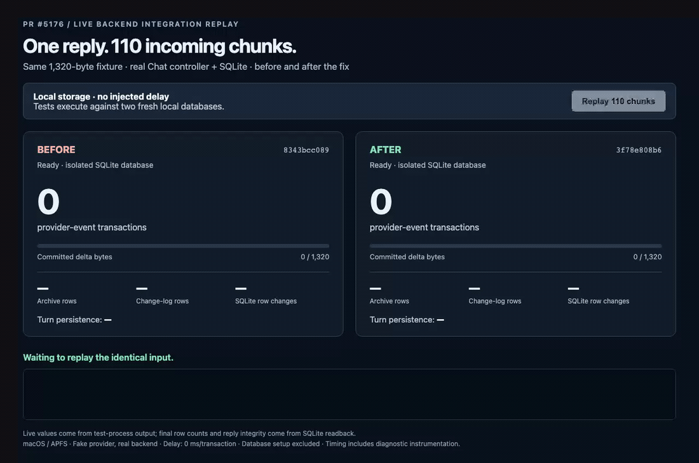
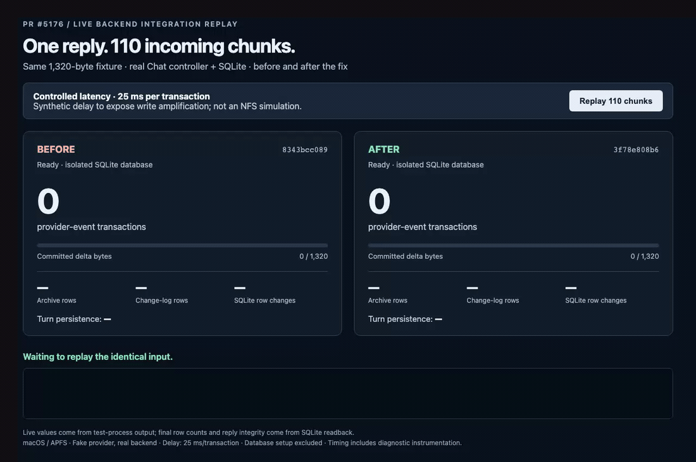

# PR #5176 — before/after recording evidence

[Implementation PR](https://github.com/Untrivial-ai/agent-orchestrator/pull/5176) · recorded 2026-09-10 on macOS/APFS.

These are screen recordings of a **live backend integration-test monitor**, using a fake provider and the real Chat controller and SQLite store. They are not recordings of the AO desktop UI and do not reproduce the reported NFS stall. Every counter is supplied by the running test processes. Final row counts, completed-turn state, and reply integrity are checked through SQLite readback.

- Before: `8343bcc089982e202f0fbc37ff43aa09de3110d4`.
- After: `3f78e808b61f68f00f3e8e940f5a15bc46278fde`.
- Identical input: 110 immediately available 12-byte chunks, totaling 1,320 bytes (`"hello world "` repeated 110 times).
- Both databases are fresh and isolated. Database setup is excluded from measured turn time.
- Playback is real time. Initial/final holds make the recording readable; the on-screen duration comes from Go's measured turn-persistence interval, not total video length.

## Recordings

### Normal local storage — no injected delay



[Full-resolution MP4](normal-storage.mp4) · [Raw WebM recording](normal-storage.webm) · [Results](normal-storage-results.json) · [Before log](0ms-before.log) · [After log](0ms-after.log)

### Controlled latency — 25 ms per transaction



[Full-resolution MP4](controlled-latency.mp4) · [Raw WebM recording](controlled-latency.webm) · [Results](controlled-latency-results.json) · [Before log](25ms-before.log) · [After log](25ms-after.log)

This second recording deliberately sleeps for 25 ms inside each existing provider-event transaction callback in **both versions**. It demonstrates how reducing transaction count changes accumulated storage overhead. It is **not an NFS locking simulation**, an end-to-end model-response benchmark, or evidence of a universal speedup.

## Measured results

| Measurement | Before | After |
|---|---:|---:|
| Provider-event transactions | 113 | 4 |
| Archive rows | 113 | 4 |
| Session-updated change-log rows | 118 | 9 |
| SQLite row changes | 469 | 33 |
| Reply bytes, verified by readback | 1,320 | 1,320 |
| Turn persistence, no injected delay | 125.563 ms | 15.640 ms |
| Turn persistence, 25 ms/transaction | 3108.449 ms | 122.526 ms |

The reply SHA-256 is identical across both commits and both scenarios:

`20cb68666417cec0ffe6419320815d4f04ea74330d5a266aaabd769d1ef4ec2a`

Timings include diagnostic instrumentation and are single local observations. Counts are the primary evidence. A slower provider stream can form smaller batches. Transaction counts include turn start, message deltas, message completion, and turn completion; the full measured interval also includes send/lifecycle changes in the SQLite change counters.

## Reproduce

The diagnostic Go files are injected with `go test -overlay`; production source files are unchanged. The same overlay fixture is compiled separately at each commit. `build.py` generates absolute overlay paths for the supplied checkouts. It depends on the existing test helpers at those commits.

1. Create detached Git worktrees at the before and after commits under an isolated directory within `~/.ao/debug/`.
2. Download the evidence source files into a separate directory under `~/.ao/debug/`.
3. Run `python3 build.py /absolute/path/to/before /absolute/path/to/after`.
4. To reproduce counters without a browser, use the following commands from the evidence directory. The barrier file allows both test fixtures to finish setup before replay begins.

```sh
mkdir -p tmp
# For a single terminal run, pre-create its start barrier.
touch start
AO_EVIDENCE_DELAY_MS=0 AO_EVIDENCE_START_FILE="$PWD/start" TMPDIR="$PWD/tmp" ./before.test -test.run='^TestIssue5176Evidence$' -test.v
AO_EVIDENCE_DELAY_MS=0 AO_EVIDENCE_START_FILE="$PWD/start" TMPDIR="$PWD/tmp" ./after.test -test.run='^TestIssue5176Evidence$' -test.v
# Repeat with AO_EVIDENCE_DELAY_MS=25 for the controlled latency case.
```

For a fresh recording, install Python Playwright and its Chromium browser, then run `python3 record.py`. `PLAYWRIGHT_CHROMIUM_EXECUTABLE` optionally selects an already installed Chromium executable. The recorder serves the monitor only on loopback, prepares both databases, releases a shared start barrier when the button is clicked, verifies test success and matching reply hashes, and captures Chromium's actual viewport. Profiles, databases, recordings, and logs stay alongside the script under the evidence directory.

Source: [Go replay fixture](evidence_repro_test.go), [SQLite counter accessor](issue4657_repro.go), [build helper](build.py), [recorder](record.py), [monitor](monitor.html).

No recording or diagnostic helper is included in the implementation PR's diff.
