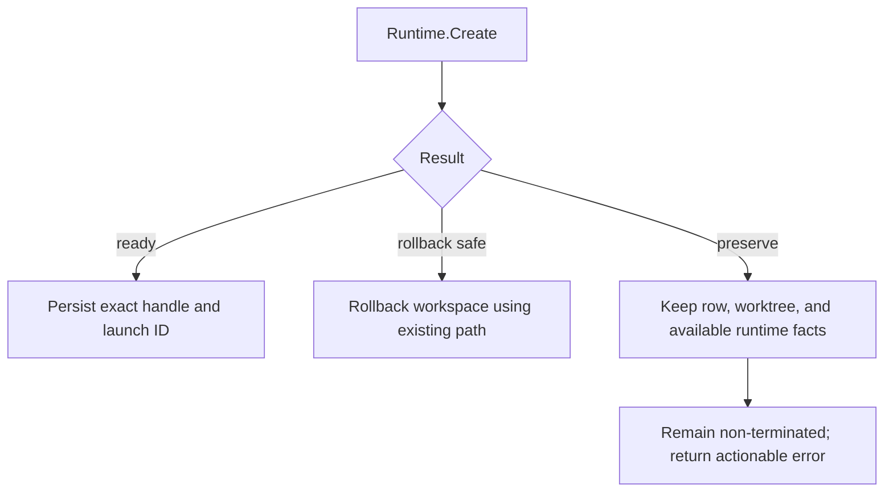

# PR #3550 C: exact-generation worker runtime lifecycle hardening

Status: approved; documentation complete; implementation not started from the
accepted design

Date: 2026-08-11

## Authority

- Decision: [ADR 0004](../adr/0004-worker-runtime-lifecycle-outcomes.md)
- Evidence: [tmux/systemd worker lifecycle research](../compatibility/20260811-v1.0-tmux-systemd-worker-lifecycle-research.md)
- Existing delivery plan:
  [PR #3550 cross-platform remediation](2026-08-10-pr-3550-cross-platform-remediation.md)

If this plan conflicts with ADR 0004, ADR 0004 controls the architecture. The
existing remediation plan remains the evidence log for prior exact heads; its
random-token round-four proposal is superseded by ADR 0004.

## North star

> AO may delete a worker's workspace or declare its runtime released only when
> it has authoritative evidence about that exact `RuntimeLaunchID`; uncertainty
> preserves ownership evidence and user data.

The success criterion is not merely that systemd kills a `setsid` descendant.
It is that Create, Restart, Destroy, spawn rollback, and agent switching all
agree on one exact generation and never convert an unknown runtime outcome into
worktree deletion.

## Baseline and implementation starting point

Authoritative readback on 2026-08-11 reported:

- upstream `main` and PR base:
  `cfbefa4cdbd5e8c8e020177e53d105f10e5f44ee`;
- upstream PR #3550 and fork branch head:
  `59a317a252dad8b1a92c296b7f0d3e7095ebaee8`;
- the published exact head passed the fork's Go, lint, API drift, container,
  gitleaks, and Ubuntu/macOS/Windows jobs; and
- the stopped local worktree contains an uncommitted random-token proposal that
  predates ADR 0004 and must not be carried forward mechanically.

Do not rebuild the full PR from upstream `main`. After authoritative ownership
and remote-head readback, create or restore one clean sole-writer worktree at the
published PR head. Preserve the stopped dirty worktree as evidence until the
accepted implementation is safely committed. Reapply the three new design
documents, then implement C from ADR 0004.

If either remote head or base changes, stop, read the new range, and refresh
this baseline before code changes.

## Scope

### In scope

- the internal runtime config/handle and lifecycle-error contract;
- exact `RuntimeLaunchID` propagation for primary managed TUI agent launches;
- tmux ownership metadata written in the same command sequence as creation;
- systemd unit identity derived from session ID plus launch ID;
- conservative reconciliation of canceled/timed-out tmux Create;
- exact-generation Destroy and stop-before-start Restart;
- Session Manager spawn, rollback, restore, kill, replacement, interface
  transition, and agent-switching paths that own worker runtime/worktree order;
- compatibility adaptation and tests for ConPTY; and
- exact-head local, native-platform, Linux canary, CI, and independent-review
  gates.

### Out of scope

- enabling containment by default;
- production AO binary, service, database, Dashboard, environment, restart, or
  cutover;
- macOS containment or Windows systemd behavior;
- memory, CPU, or other resource limits;
- durable cleanup-pending storage, migrations, retry queues, or daemon-crash
  reconciliation;
- configuration-drift migration for already-running sessions;
- Docker/container cleanup;
- reviewer or standalone shell-terminal lifecycle redesign;
- API, OpenAPI, frontend, CLI, or external script changes;
- fixing issue #3807's read-only-directory removal; and
- unrelated tmux lifecycle cleanup or refactoring.

Those durable lifecycle and rollout concerns are D or independent PRs.

## Required invariants

1. `RuntimeLaunchID` is the only generation identity; no creation token exists.
2. A contained systemd unit name identifies one session plus one launch.
3. A tmux session name alone never authorizes generation cleanup.
4. A nil Destroy result means the requested exact generation is released.
5. Create error paths explicitly say rollback-safe or preserve.
6. Preserve outcomes keep the session row and worktree and never mark the row
   terminated.
7. Restart proves the old exact generation released before starting the new one.
8. Unknown marker/probe state never kills a possibly foreign tmux session.
9. Reviewer, shell-terminal, Chat, default-unset, macOS, and Windows behavior
   remain outside systemd containment.
10. No workspace cleanup runs before runtime cleanup is confirmed.

## Target architecture

### Internal runtime identity

Extend the internal `ports.RuntimeConfig` and `ports.RuntimeHandle` with the
existing launch ID. Exact field/type names may follow repository style, but the
semantic pair is fixed:

```text
Runtime instance = stable terminal handle ID + RuntimeLaunchID
```

Primary managed TUI agent callers set both fields. Reviewer and shell-terminal
callers leave launch ID empty and therefore use legacy runtime behavior. ConPTY
retains the ID for contract parity and future-safe exact observations but does
not enable systemd.

### Create outcome boundary

Represent preserve-required failures with a typed internal runtime error or
equivalent result that carries the exact requested reference and a disposition.
The caller must be able to decide the following without parsing error strings:



Ordinary validation failures before any external mutation are rollback-safe.
A confirmed cleanup after an owned failed creation is rollback-safe. A foreign
marker, missing marker after an uncertain command, failed ownership probe,
failed exact cleanup, or otherwise unknown outcome requires preservation.

### tmux ownership and reconciliation

For contained worker creation:

1. derive the tmux session name and exact scope name from the requested runtime
   reference;
2. run `new-session` followed by setting
   `@ao-runtime-launch-id=<RuntimeLaunchID>` in one tmux command sequence;
3. perform existing setup and readiness checks;
4. on cancellation or timeout, use a cancellation-detached but bounded probe;
5. kill the tmux session only when its marker matches the requested launch;
6. release only the exact generation's systemd scope; and
7. return preserve when ownership or final release cannot be proven.

The current preflight absence check and separate random token are removed.

### Destroy and Restart

Contained Destroy:

- verifies marker ownership before killing the stable tmux session;
- stops and verifies the exact generation's scope independently;
- treats an already-missing exact resource as success;
- preserves a tmux session marked for another generation; and
- returns an error whenever exact release remains unconfirmed.

Contained Restart:

1. receives the old exact handle and a new runtime config/launch ID;
2. releases the old exact scope and stops if that is unconfirmed;
3. respawns the existing pane for the new launch;
4. updates the tmux marker to the new launch in the same ordered operation where
   supported;
5. waits for the new exact scope and runtime readiness; and
6. returns the stable terminal ID paired with the new launch ID.

No overlap is preferred over availability. Restart downtime is accepted.

### Session Manager preservation

Audit every primary worker path that currently calls runtime Create, Restart,
or Destroy and then mutates session/workspace state. The common rule is:

```text
runtime exact release confirmed -> workspace transition may continue
runtime release unknown         -> preserve row and workspace; stop
```

For a failed Create preserve outcome, store available workspace, handle, and
launch facts in existing session metadata and leave the row non-terminated.
Do not overload `is_terminated` as cleanup intent. D will add a durable cleanup
state rather than C inventing a new display status or schema field.

## Affected components

| Component | Responsibility in C |
| --- | --- |
| `backend/internal/ports/outbound.go` | launch identity and machine-readable preserve outcome |
| `backend/internal/adapters/runtime/tmux/commands.go` | tmux launch marker command sequence and exact probes |
| `backend/internal/adapters/runtime/tmux/tmux.go` | per-launch containment selection, Create reconciliation, exact Destroy/Restart |
| `backend/internal/adapters/runtime/tmux/systemd_containment.go` | generation-specific unit naming and authoritative final state |
| `backend/internal/adapters/runtime/conpty/runtime.go` | internal-port compatibility without systemd behavior |
| `backend/internal/adapters/runtime/runtimeselect/` | compile-time contract parity; no platform-policy widening |
| `backend/internal/session_manager/manager.go` | spawn rollback and worker teardown ordering |
| `backend/internal/session_manager/agent_switching.go` | old/target generation fencing and cleanup preservation |
| `backend/internal/session_manager/interface_transition.go` | exact worker runtime teardown before mode transition |
| reviewer and shell-terminal tests | prove their launch configs remain uncontained |
| existing ADR/plan plus these documents | scope, rationale, and verification authority |

Do not add wrappers that only rename the runtime calls. Keep the critical path
linear: classify outcome at the adapter boundary, then make one preservation
decision at the lifecycle owner.

## Implementation slices

### C0: restore a clean sole-writer baseline

Predecessor: none.

1. Require AO/core ownership evidence or an explicitly authorized unowned
   isolated-worktree fallback before mutation.
2. Re-read upstream PR head, fork branch head, base, reviews, threads, and
   checks.
3. Preserve the stopped dirty worktree and its diff.
4. Establish one clean writer at exact published head `59a317a2`, unless live
   readback shows a new head.
5. Add the accepted documents without carrying the random-token code proposal.

Acceptance: one writer, clean exact baseline, remote unchanged, production
unchanged.

### C1: pin the internal contract with tests

Predecessor: C0.

1. Add launch ID to runtime config/handle and a typed preserve disposition.
2. Update fakes and ConPTY mechanically.
3. Add contract tests showing that worker handles carry the launch ID while
   reviewer and shell-terminal handles do not opt into containment.
4. Keep all external DTOs and persisted schemas unchanged.

Acceptance: backend compiles on Linux; focused port/runtime/session-manager
tests describe all three Create outcomes without string parsing.

### C2: implement exact tmux and systemd identity

Predecessor: C1.

1. Replace `@ao-creation-token` with `@ao-runtime-launch-id`.
2. Remove random token generation and preflight absence logic.
3. Derive scope identity from session plus launch ID with deterministic,
   bounded, collision-resistant formatting.
4. Make containment conditional on a managed launch ID, not merely adapter
   configuration.
5. Add matching, mismatch, missing-marker, duplicate, and probe-failure tests.

Acceptance: no name-only destructive action; reviewer/shell paths make no
systemd calls; minimum-tmux command construction remains compatible.

### C3: close Create and spawn rollback

Predecessor: C2.

1. Classify all pre-create, uncertain-create, post-create, and failed-cleanup
   paths as rollback-safe or preserve.
2. Detach cleanup from caller cancellation while retaining bounded tmux/systemd
   timeouts.
3. Teach Session Manager to retain row/worktree and exact facts on preserve.
4. Keep safe failures on the existing rollback path.
5. Ensure launch preparation is canceled without erasing preserved facts.

Acceptance: no Create error can both leave runtime ownership unconfirmed and
delete the workspace or mark the session terminated.

### C4: close Destroy, Restart, and worker lifecycle callers

Predecessor: C3.

1. Make tmux Destroy exact-generation-aware.
2. Implement stop-before-start Restart with a new launch ID.
3. Audit worker spawn completion, prompt-delivery failure, restore, kill,
   replacement, interface transition, and agent switching.
4. Remove ignored Destroy results wherever later code removes a worker
   workspace, changes ownership, or claims termination.
5. Preserve state and stop the transition on cleanup uncertainty.

Acceptance: every worker workspace transition has a preceding confirmed exact
runtime release; no old/new scope overlap occurs during Restart.

### C5: compatibility and native-platform closure

Predecessor: C4.

1. Run focused Linux tests and cross-check the full runtime caller inventory.
2. Prove macOS keeps tmux SID behavior and Windows keeps ConPTY behavior.
3. Prove reviewer, shell terminal, and Chat boundaries remain unchanged.
4. Run the existing Ubuntu/macOS/Windows GitHub matrix on one exact head.

Acceptance: no external contract or platform behavior changes outside the
explicit Linux worker option.

### C6: canary, complete gates, and independent review

Predecessor: C5.

1. Run the Linux containment canary including exact unit readback.
2. Run all repository and generated-artifact gates applicable to the final
   diff.
3. Push only with a lease tied to authoritative remote head readback.
4. Require all hosted checks on the exact current head.
5. Perform one code review separate from CI and automated diagnostics.
6. Freeze scope after this review. Findings requiring persistence, default
   rollout, resource policy, or a broader lifecycle/store design become D or a
   follow-up issue.

Acceptance: exact-head checks pass, Linux canary passes, review is clean,
actionable threads are zero, and production remains unchanged.

## Test plan

### Contract and unit matrix

| Area | Required cases |
| --- | --- |
| runtime identity | worker launch ID round-trip; blank legacy caller; invalid/empty contained identity rejected before mutation |
| tmux command sequence | marker set after winner create; duplicate cannot overwrite; exact target formatting |
| Create safe failure | validation failure; definite command rejection; owned failure with confirmed cleanup |
| Create preserve | cancellation after possible accept; marker mismatch; marker missing; marker probe failure; scope cleanup failure; post-create cleanup failure |
| collateral safety | foreign/concurrent session receives no `kill-session`; unrelated scope/process survives |
| Destroy | matching generation; mismatched generation; missing session/scope; tmux failure; scope failure; canceled caller with bounded detached cleanup |
| Restart | old release precedes respawn; old release failure blocks respawn; new generation identity differs; replacement failure cleanup; stable terminal ID |
| Session Manager | safe Create error rolls back; preserve Create keeps row/worktree; failed MarkSpawned/prompt delivery preserves on Destroy error; no false termination |
| agent switching | source generation fenced; target generation exact; cleanup uncertainty blocks commit/rollback and preserves worktree |
| excluded callers | reviewer and shell terminal produce no systemd containment calls; Chat creates no runtime |
| platforms | Linux tmux/systemd; macOS tmux legacy; Windows ConPTY; config policy remains deterministic |

Use deterministic fakes for every error edge. Do not rely on millisecond races
to manufacture uncertainty. Where concurrency matters, use barriers/channels to
hold the winner and loser at known points and run race-enabled tests.

### Focused local commands

Run from `backend/` unless noted:

```bash
go test -count=1 ./internal/ports ./internal/adapters/runtime/runtimeselect
go test -count=1 ./internal/adapters/runtime/tmux ./internal/adapters/runtime/conpty
go test -count=1 ./internal/session_manager ./internal/service/shellterm ./internal/review
go test -race -count=1 ./internal/adapters/runtime/tmux ./internal/session_manager
```

If `internal/ports` has no test files, compilation through the adapter and
Session Manager packages is the focused port gate; do not add an empty test
package solely to satisfy the command list.

Then run repository gates represented by the changed surface:

```bash
go build -p 2 ./...
go vet -p 2 ./...
go test -race -p 2 ./...
```

From the repository root:

```bash
npm run lint
npm run frontend:typecheck
git diff --check
```

No API or sqlc regeneration is expected. If implementation evidence shows a
generated contract changed, stop because C crossed its approved boundary.

### Linux systemd canary

Run only on an isolated compatible user-systemd host:

```bash
AO_TEST_SYSTEMD_CONTAINMENT=1 go test ./internal/adapters/runtime/tmux \
  -run TestRuntimeIntegrationSystemdContainment -count=1 -v
```

The final canary must prove:

- a child that calls `setsid` remains in the exact launch scope;
- a child that ignores `TERM` is removed by bounded escalation;
- Restart releases the old exact scope before the new exact scope becomes
  active;
- Destroy leaves the requested exact scope inactive/dead or not found;
- tmux marker and scope identity both match `RuntimeLaunchID`;
- a concurrently created or deliberately foreign-marked tmux session survives
  the losing creator's reconciliation;
- an outside-scope negative-control process survives; and
- reviewer/shell-terminal negative controls create no worker scope.

After the test, read back the exact disposable units and tmux server. Test
cleanup is not accepted merely because the Go command returned zero.

### GitHub native-platform and exact-head gates

On one exact current head require:

- Ubuntu, macOS, and Windows native config/runtime jobs;
- Go build, tests, race, vet, and lint as configured by current workflows;
- API drift, container smoke, gitleaks, and other required repository checks;
- no stale same-SHA failure unless a later authoritative rerun proves it was
  infrastructure-only; and
- an independent current-head code review covering the full upstream-base to
  head range.

CI, React Doctor, and resource scans are evidence inputs, not substitutes for
the independent code review.

## Review checklist

The independent review must cover:

- whether all destructive calls are generation-fenced;
- whether every Create error is classified without error-string parsing;
- whether Session Manager preserves row/worktree on unknown cleanup;
- whether any worker lifecycle path still ignores Destroy;
- whether reviewer/shell/Chat behavior is unchanged;
- whether ConPTY and macOS contracts remain valid;
- whether unit-name formatting is deterministic and collision-resistant;
- whether contexts are detached only for bounded cleanup; and
- whether D concerns have leaked into C.

## Stop conditions

Stop and preserve state if:

- the PR or fork head changes unexpectedly;
- a second writer appears or ownership cannot be proven;
- the accepted implementation needs a database/API/frontend change;
- a fix requires default enablement, crash recovery, persistent cleanup, memory
  limits, or reviewer/shell redesign;
- exact cleanup cannot be made collateral-safe with `RuntimeLaunchID`;
- native platform behavior changes outside the compatibility matrix; or
- any action would change production AO.

## Rollback and handoff

C remains opt-in, so source rollback is removal of the C commits while the
unset configuration path remains the compatibility fallback. Preserve the last
published PR head and the stopped pre-ADR worktree until the replacement exact
head passes all gates.

After C converges, D may build on its exact identity and preserve outcome. C
does not make D harder: it supplies the generation key and caller contract D
needs for persistent cleanup and restart reconciliation, without choosing D's
schema or controller implementation.
