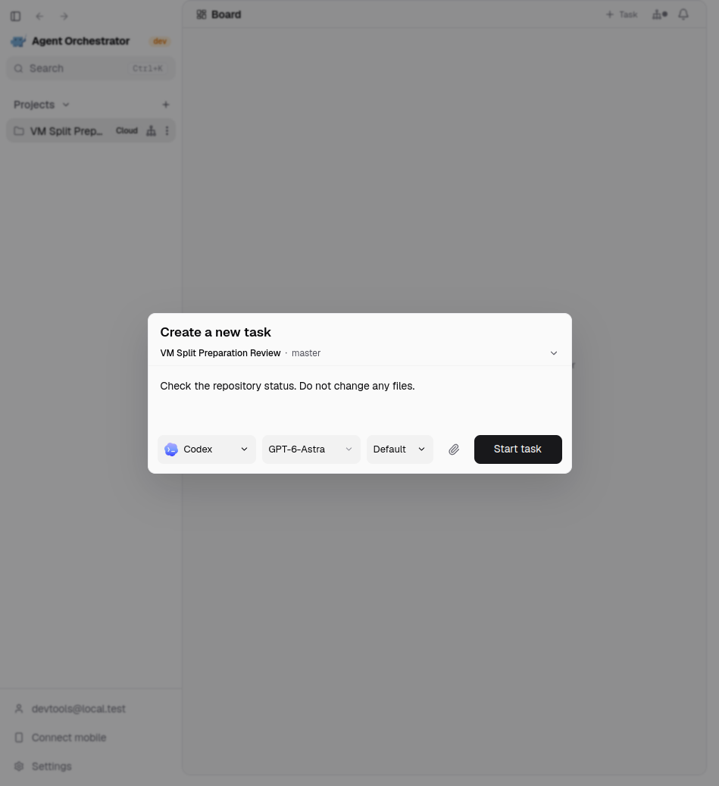
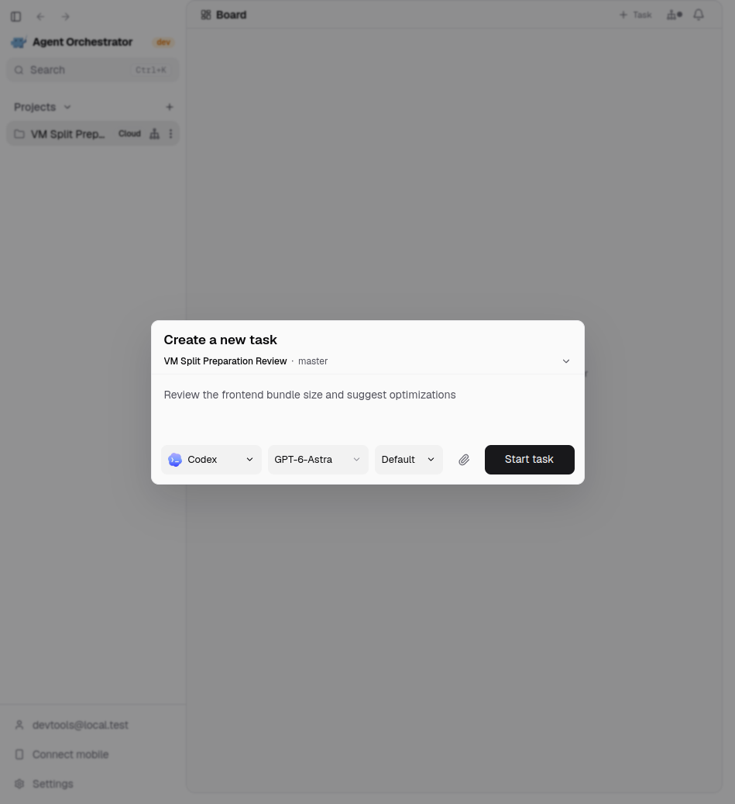
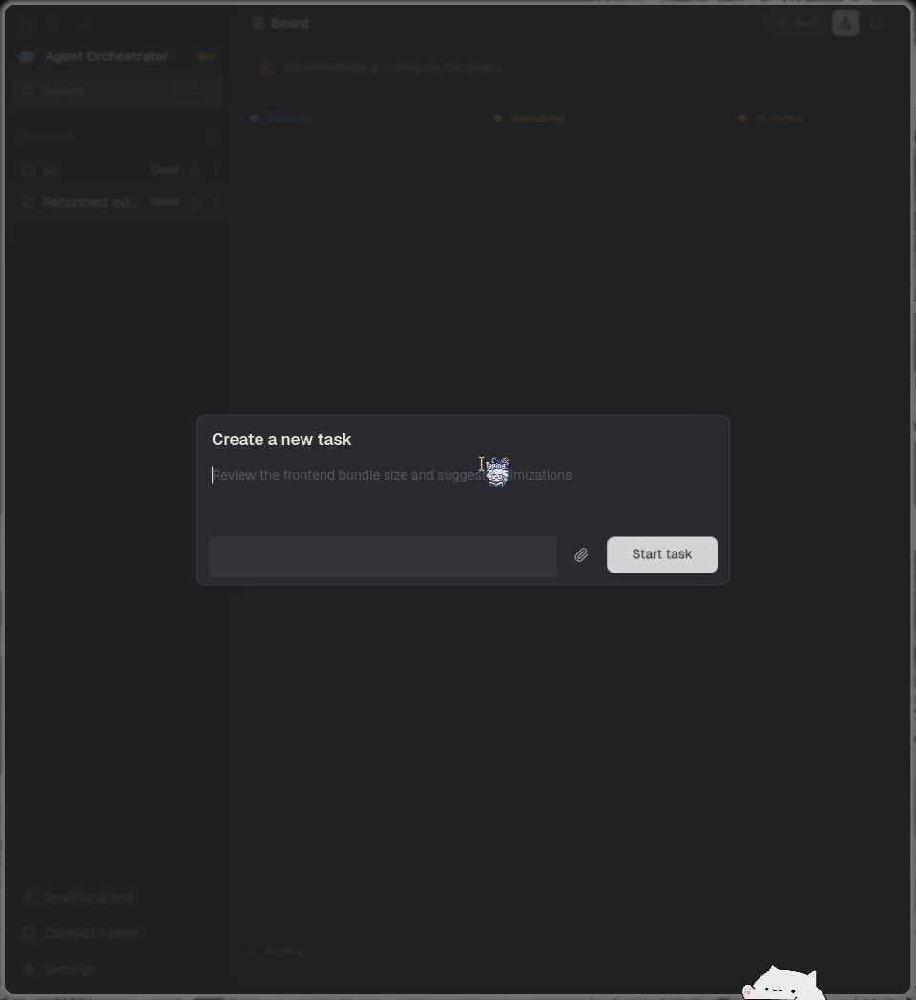

# Preparation reconnect evidence

## Independent preparation branch, 2026-09-26

Fresh native Electron checkout, separate locked dependencies, scratch desktop
data and a disposable Docker control plane. The worker binaries were rebuilt
from the preparation-only branch. No browser feature was required.

A configured harness was selected and a draft entered without submitting work.
The composer was closed, reopened, and given the same harness/model selection.
Database and Docker observations retained the same active preparation ID and
worker ID before and after reopening. The second running worker was the
pre-existing disposable orchestrator, not a duplicate preparation. Earlier
idle preparations were terminated rather than left running.

[Native composer close and reopen recording](split-reuse-native.mp4)

The recording uses actual desktop captures at two frames per second. Menu
triggers were keyboard-activated and the harness item selected through its DOM
handler. Local development auth and a placeholder credential were used. No
task was submitted, so this proves preparation/reuse, not provider login or
successful task execution.

## Historical combined-branch capture

Captured 2026-09-23 from the original combined implementation in the real
Electron app with isolated data and a disposable Docker project. This is
historical evidence, not fresh verification of the split branch.

Closing and reopening the composer kept the field editable. Database checks
found one active preparation, one sandbox, the same identities and matching
expiries. Credential-specific selector labels were redacted in these original
captures. No hosted-provider authentication or latency claim is made.

[Close and reopen recording](reconnect-grace.mp4)

See [the current preparation runbook](../../cloud-session-preparation.md).
