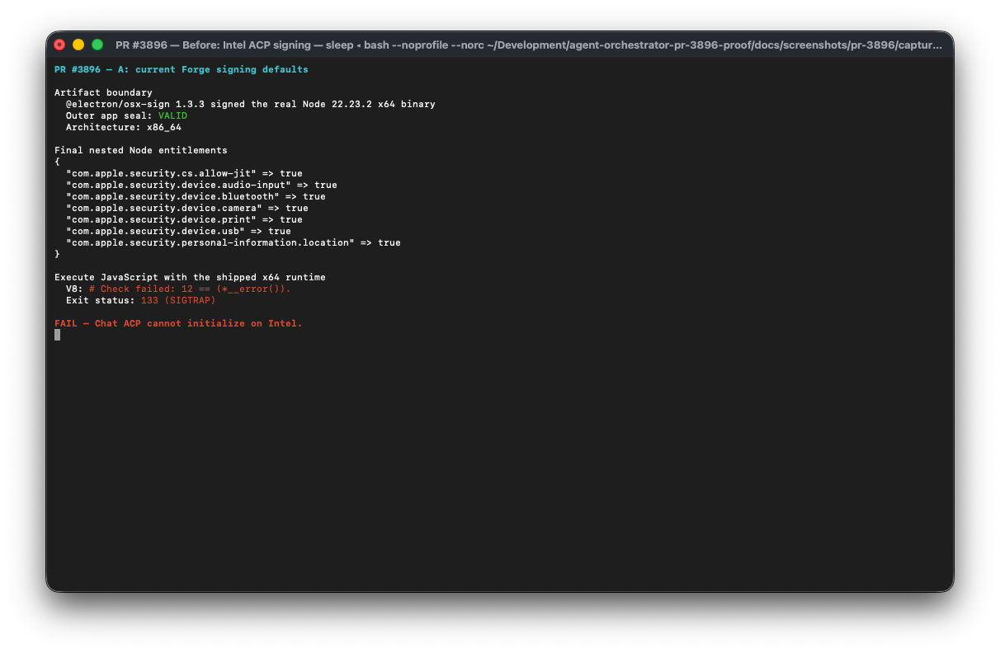
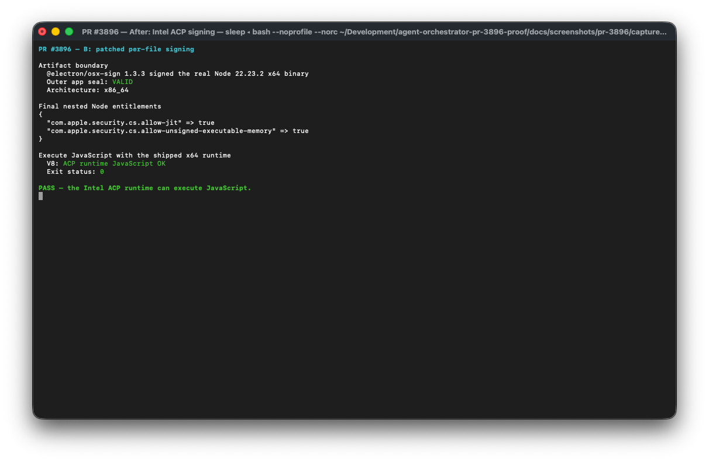

# PR #3896 A/B evidence

This is an end-to-end test of the exact packaging boundary changed by the PR.
Both runs used:

- the official Node v22.23.2 Darwin x64 binary bundled by AO;
- the pinned `@electron/osx-sign` 1.3.3 implementation;
- a nested path matching
  `Contents/Resources/acp-runtime/node/bin/node`;
- Hardened Runtime signing and a valid outer app seal; and
- the same JavaScript command under x86_64/Rosetta on macOS.

The host is Apple silicon, but the test executes the real x64 Node/V8 binary.
It reproduces the same V8 `SetPermissions` assertion and exit 133 reported by
native Intel users in #3879.

## A — current Forge defaults crash the bundled x64 Node

The baseline lets `@electron/osx-sign` apply its normal Darwin entitlements.
The outer app passes `codesign --verify --deep --strict`, but the nested Node has
`allow-jit` without `allow-unsigned-executable-memory`. Executing JavaScript
crashes with V8's `Check failed: 12 == (*__error())` and exit 133.

## B — PR #3896 runs the same x64 Node successfully

The patched run passes the PR's `macSignOptionsForFile` result into the same
signer. The final Node signature contains both required entitlements, the outer
app seal remains valid, and the identical JavaScript command exits 0.

This proves the PR through the current Packager/Signer/Node execution boundary.
It does not claim to be a production Developer ID/notarization run; those
credentials belong to the release conductor. The canonical
`scripts/verify-mac-artifact.sh` gate now checks these final nested entitlements
and executes the shipped Node, so the production x64 zip must prove the same
behavior before it is accepted.
