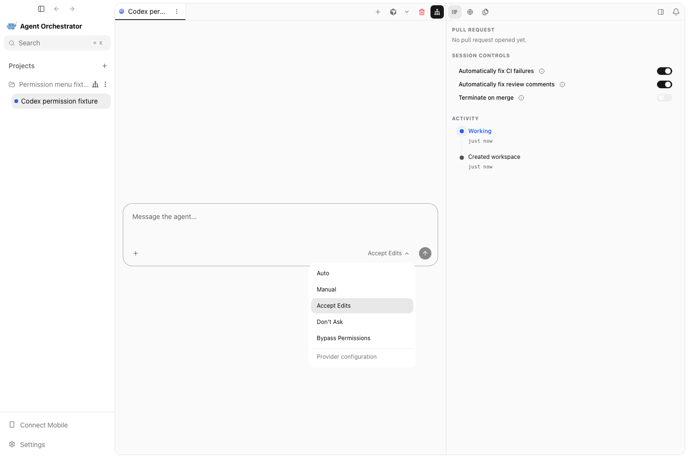

# PR #4930 visual evidence

Captured 2026-09-05 from this PR's actual React renderer at 1440×960 using deterministic daemon and native-bridge fixtures on isolated port 5196. These are renderer regression captures, not live-provider or packaged-Electron execution evidence. Dependency symlinks caused Vite to use fallback fonts.

Both providers show the same five AO permission labels. The Codex menu also offers a separate **Provider configuration** reset, which must not be mislabeled Manual.




The accompanying Playwright regression verifies the visible order and that selecting **Manual** sends `approvalMode: "manual"` to Codex turn settings, versus the native ACP `value: "default"` for Claude. The tests intercept renderer HTTP requests; provider execution semantics are covered separately by the backend permission tests.

Reproduce from the repository root:

```sh
AO_E2E_PORT=5196 AO_CAPTURE_PERMISSION_EVIDENCE=1 npm --prefix frontend run test:e2e -- chat-permission-menu.spec.ts --workers=1
```
