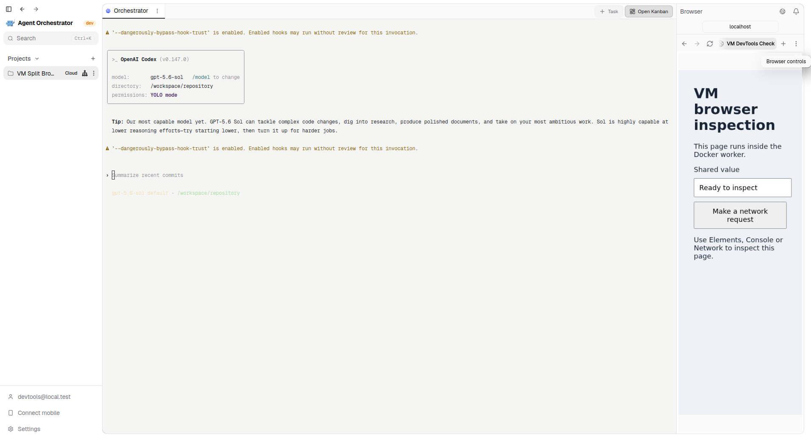
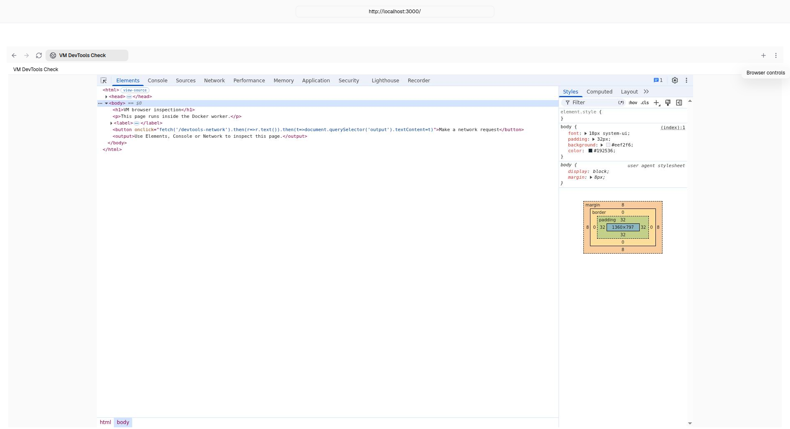
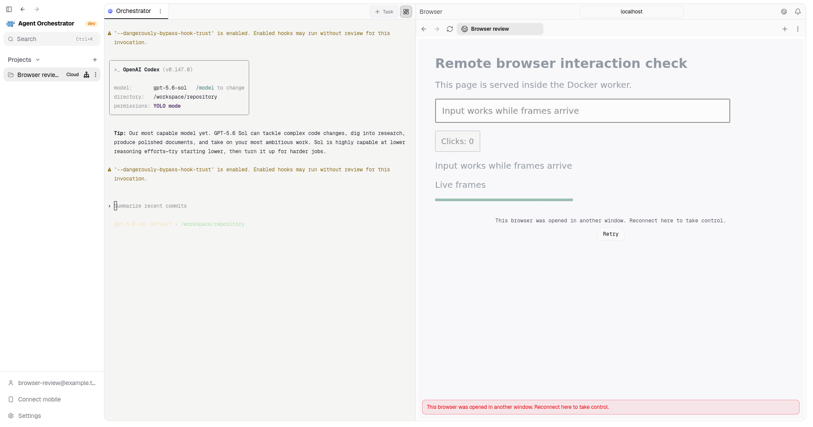
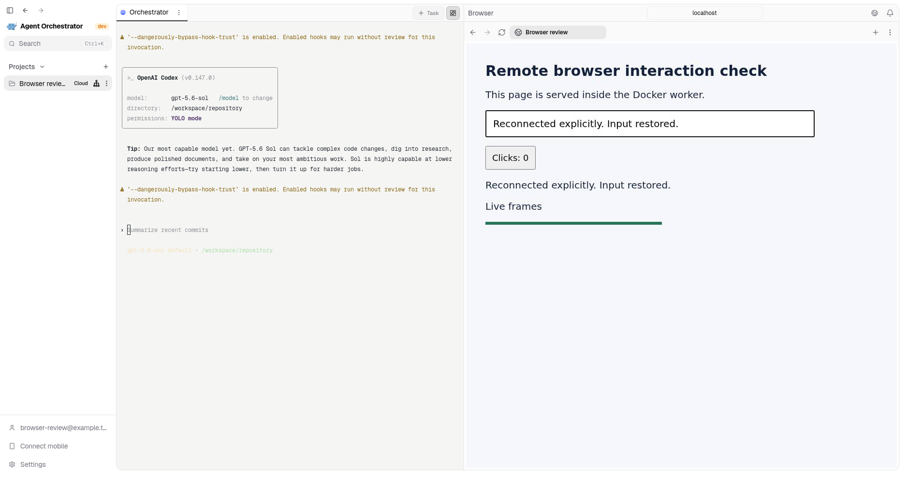

# PR #5543 browser evidence

See [the current browser runbook](../../cloud-shared-browser.md). Older captures
below predate the feature split; they are historical evidence only.

## Independent browser branch, 2026-09-26

Fresh native Electron checkout of the browser-only branch, with its own locked
dependencies, scratch desktop data and disposable Docker control plane. The
database migrated through version 41, without preparation migrations. The
worker and control-plane binaries were rebuilt from this branch.

The page is served on port 3000 inside the worker. The pop-out displays the
worker's bundled Elements inspector. Closing the inspector returns to the page;
reopening it retains the inspected page. The recording uses real desktop
captures at two frames per second, not a reconstructed screen.

[Native page and inspector switching](split-devtools-native.mp4)

The menu trigger was activated with the keyboard; menu-item and close-button
handlers were activated through DOM automation. Host pointer automation was
not reliable, so these captures do not prove physical pointer interaction.
Real Chromium regression tests separately exercise remote input and inspector
panels. Local development auth and a placeholder harness credential were used;
this does not establish hosted provider authentication or task execution.

## Shared browser viewer

The screenshot shows one real Cloud session in the native desktop app. The
terminal is active on the left, and the Browser inspector on the right is
painting the same Chromium process inside the worker. Desktop pointer input
changed the button to `Verified`, desktop keyboard input filled the text field,
and a session-side update changed the status copy and the painted canvas.

[Live shared-browser recording](cloud-browser-live-viewer.mp4)

## Review follow-up, 2026-09-24

Captured from an isolated native Electron checkout, with fresh control-plane
and worker binaries, a real Docker provider, and scratch application data.
The textarea page was served on loopback inside the worker. The screenshots
include the surrounding application, not a reconstructed interface.

Pointer focus, text replacement, native desktop clipboard paste, viewport
resizing, and viewer reattachment were exercised. This found and fixed a
canvas default-focus action that prevented native paste from reaching the
editable input. The 43.6-second recording includes the corrected input flow.

The local control plane used development authentication, a placeholder harness
credential, and a seeded public repository. The terminal correctly shows that
provider login is absent. These captures do not establish provider authentication
or remote Coder/NodeOps provisioning. Desktop undo/redo was attempted but not
independently asserted; its automated and worker-side checks remain separate.

[Native input recording](review-input-focus.mp4)

## Review fixes, 2026-09-25

Captured from another isolated native Electron checkout with scratch data and
a real Docker worker running the updated binaries. Input reached the worker
page while it continuously produced frames. A second viewer connection
replaced the desktop viewer; the notice remained visible for eight seconds
without automatic takeover. Clicking Retry restored control and text input.

A 21.2-second screen recording was attempted but omitted: a host compositor
recovery dialog obscured the application. The screenshots capture the actual
native renderer, including the surrounding application. The local control
plane used development authentication, a placeholder harness credential, and
a public repository. Hosted-provider authentication and provisioning were
not tested in this run.
