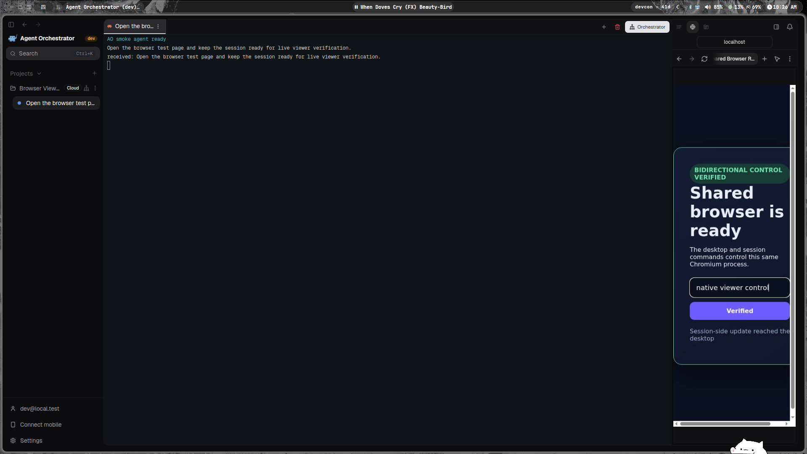
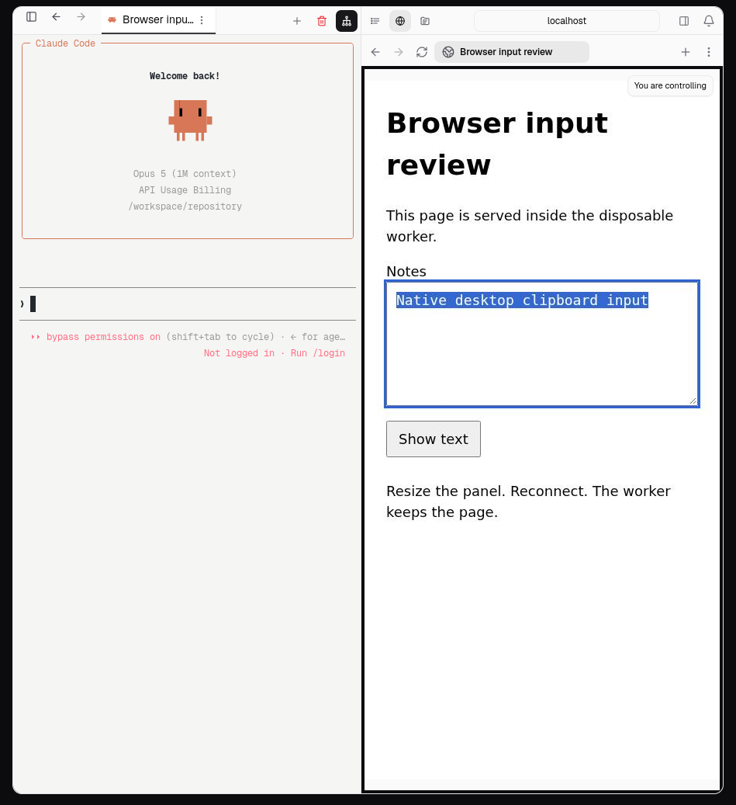
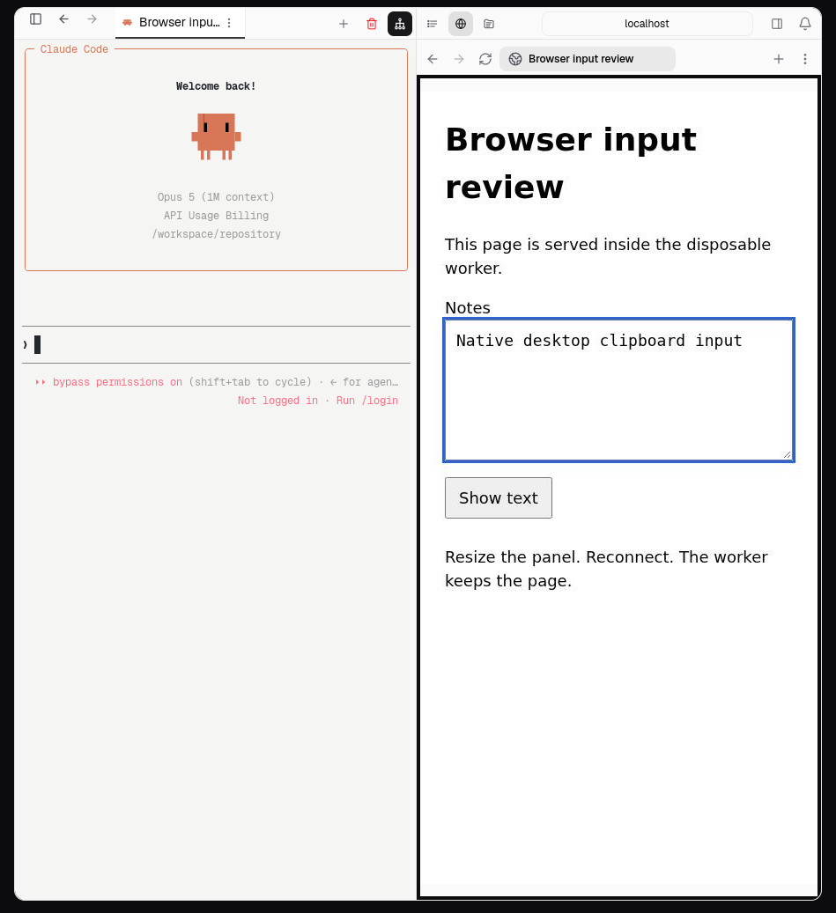

# PR #5543 visual evidence

Captured 2026-09-23 from the committed branch in the real Electron desktop app.
The app used a fresh browser profile, daemon directory, local Docker control
plane, and disposable project.

The recording shows the Cloud task composer closing and reopening within the
grace window. The reopened task field was editable. A database assertion after
reopen found one active preparation, one sandbox, the same session and sandbox
ID, and equal preparation expiries. Credential-specific selector labels are
redacted from the media.

[Close and reopen recording](reconnect-grace.mp4)

## Shared browser viewer

The screenshot shows one real Cloud session in the native desktop app. The
terminal is active on the left, and the Browser inspector on the right is
painting the same Chromium process inside the worker. Desktop pointer input
changed the button to `Verified`, desktop keyboard input filled the text field,
and a session-side update changed the status copy and the painted canvas.

[Live shared-browser recording](cloud-browser-live-viewer.mp4)

## Review follow-up, 2026-09-24

Captured from an isolated native Electron checkout, with fresh control-plane
and worker binaries, a real Docker provider, and scratch application data.
The textarea page was served on loopback inside the worker. The screenshots
include the surrounding application, not a reconstructed interface.

Pointer focus, text replacement, native desktop clipboard paste, viewport
resizing, and viewer reattachment were exercised. This found and fixed a
canvas default-focus action that prevented native paste from reaching the
editable input. The 43.6-second recording includes the corrected input flow.

The local control plane used development authentication, a placeholder harness
credential, and a seeded public repository. The terminal correctly shows that
provider login is absent. These captures do not establish provider authentication
or remote Coder/NodeOps provisioning. Desktop undo/redo was attempted but not
independently asserted; its automated and worker-side checks remain separate.

[Native input recording](review-input-focus.mp4)
